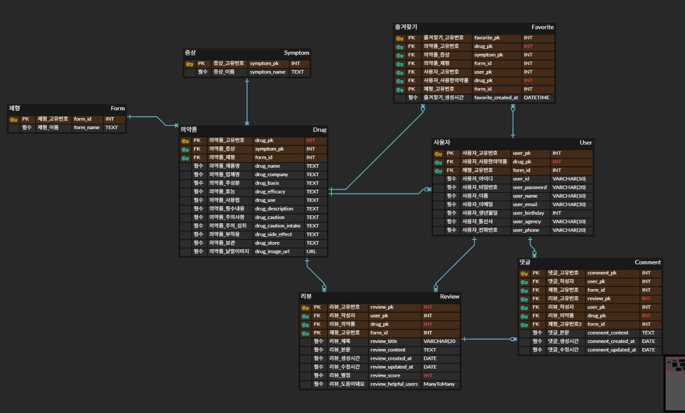

# 💊DrugSafe💊

## 학습한 내용 및 새로 배운 것
- 자연어 처리(NLP)의 실무 적용: 사용자가 입력하는 일상적인 증상 표현(예: "머리가 아파요")을 시스템이 이해할 수 있도록 처리하는 로직을 구현하며 자연어 처리의 중요성을 학습했습니다.

- AI 모델의 고도화 과정: 단순히 키워드를 매칭하는 수준에서 벗어나, 부분 일치 검색 및 후보군 제시 로직을 추가하며 사용자 친화적인 AI 기능을 구현하는 방법을 익혔습니다.

- 공공 데이터 활용 및 정제: 신뢰할 수 있는 의약품 정보를 제공하기 위해 공식적인 출처의 데이터를 수집하고 이를 서비스에 적합한 형태로 가공하는 경험을 쌓았습니다.

- 사용자 경험(UX) 중심의 설계: 전문 용어가 많은 의약품 정보를 일반 사용자의 눈높이에 맞춰 제형, 증상, 복용 중인 약 등을 고려한 인터페이스로 구성하는 능력을 키웠습니다.

## 팀원 정보 및 업무 분담 내역
### 팀장 : 박미영
```
email : a29279@naver.com
github : https://github.com/miyeong00
gitlab : https://lab.ssafy.com/a29279
```

**Backend · Community · Review System · Authentication**

- 사용자 인증 및 권한
  - 회원가입 / 로그인 / 로그아웃 구현
  - 인증 및 권한 설정
  - 로그아웃 상태 관련 버그 수정
- 의약품 조회 기능
  - 의약품 전체 조회
  - 증상별 의약품 조회
  - 제형 필터 기능 구현
  - 의약품 정렬 기능 구현
- 커뮤니티 / 리뷰 / 댓글 기능
  - 리뷰 CRUD
  - 댓글 CRUD
  - 평점 CRUD
  - 리뷰 평점 평균 및 분포 조회
  - 리뷰 상세 조회 기능
  - 커뮤니티 전체 조회 → 리뷰 상세 페이지 이동
- 사용자 인터랙션 기능
  - “도움이 돼요” 버튼 구현
  - 실시간 반영 처리
  - 버튼 상태 유지 로직
  - 즐겨찾기 등록 상태 유지

### 팀원 : 심다인
```
email : mong2822@naver.com
github : https://github.com/dain2822
gitlab : https://lab.ssafy.com/mong2822
```
**Frontend · AI Chatbot · UI/UX · Pagination · Refactoring**
- AI 챗봇 기능 전반
  - AI 챗봇 초기 구현
  - 일상 대화 처리 로직 추가
  - 의약품 정보 조회 기능 연동
  - 의약품 후보 선택 UI 구현
  - 중복 후보 제거 로직
  - 실시간 스트리밍 응답 및 로딩 스피너 적용
  - 챗봇 UI/UX 지속 개선
- 페이지네이션 설계 및 개선
  - 의약품 조회 페이지네이션
  - 리뷰 페이지네이션
  - 프로필 페이지 (내 리뷰 / 내 댓글 / 즐겨찾기) - - 페이지네이션
  - 페이지네이션 구조 재설정 및 버그 수정
- 프론트엔드 UI/UX 및 공통 컴포넌트
  - HomeView 구성 및 캐러셀 개선
  - NavBar, Footer 구현
  - 폰트 및 전체 레이아웃 간격 수정
  - 제형별 아이콘 적용 및 이미지 없는 품목 처리
  - Carousel 전환 효과 및 멘트 수정
- 데이터 및 코드 구조 관리
  - 이미지 URL 모델 추가 및 데이터 로드
  - dumpdata 생성
  - 모델 구조 수정
  - 폴더 구조 리팩토링
  - 주석 정리 및 미사용 코드 제거

## 목표 서비스 및 실제 구현 정도
### 🎯 목표 서비스

- 기획 의도: '셀프 메디케이션' 트렌드 속에서 넘쳐나는 건강 정보 중 신뢰할 수 있는 정보를 선별하고, 사용자의 상황(증상, 선호 제형, 병용 약물 등)에 맞는 맞춤형 정보를 제공하는 것.

- 핵심 가치: 공식 출처를 기반으로 한 전문성 있는 정보의 대중화.

### ✅ 실제 구현 정도

- 의약품 조회 및 추천: 정식 명칭뿐만 아니라 일상적 증상 입력으로도 약품 정보를 찾을 수 있는 기능 구현 완료.

- AI 챗봇 서비스: 단순 증상 상담을 넘어 관련 의약품 후보를 제시하는 수준까지 구현.

- 커뮤니티 및 부가 기능: 리뷰 작성, 댓글 작성 기능을 포함한 사용자 참여 공간 마련 (로그인 연동 완료).

## 데이터베이스 모델링(ERD)


## 추천 알고리즘에 대한 기술적 설명
- 증상 중심 자연어 처리: 사용자가 입력한 일상적인 표현을 분석하여 의약품 데이터베이스의 증상 카테고리와 매칭합니다.

- 부분 일치 및 후보 제시: 사용자가 약 이름을 정확히 모를 경우를 대비하여, 입력한 텍스트가 부분적으로 일치하는 의약품들을 모두 추출하여 후보군으로 보여줍니다.

- 입력 필터링 로직: 의약품 조회와 관련 없는 부적절한 입력이 들어올 경우 이를 감지하고 안정적으로 대응할 수 있는 필터링 시스템을 적용했습니다.

## 핵심 기능에 대한 설명
- 맞춤형 의약품 검색: 사용자의 현재 증상, 선호하는 약의 제형(연질캡슐 등), 현재 복용 중인 다른 약물과의 상호작용을 고려한 검색 기능을 제공합니다.

- AI 증상 기반 추천: 챗봇을 통해 대화하듯 증상을 입력하면 가장 적합한 의약품을 추천받을 수 있습니다.

- 신뢰 기반 정보 제공: 질병관리청 등 공식적인 출처를 가진 데이터를 바탕으로 백과사전식 정보가 아닌 사용자 맞춤형 가이드를 제공합니다.

- 사용자 인터랙션: 의약품 리뷰 및 댓글 기능을 통해 실제 복용 후기를 공유할 수 있는 커뮤니티 기능을 지원합니다.

## 생성형 AI를 활용한 부분
- 생성형 AI를 단순한 질의응답 도구가 아닌, 사용자의 모호한 자연어 요구를 정형화된 의약품 데이터와 연결하는 핵심 엔진으로 활용
- 이전에 다루지 않았던 기술적 한계를 직접 분석하고, 서비스 관점에서의 해결 방향을 수립
#### 기술적 성과 및 의미
- 자기주도적 문제 해결 능력

  학습하지 않은 영역인 페이지네이션 구조를 스스로 분석하고, 실제 서비스 성능 개선으로 이어질 수 있는 기술적 방향성을 수립하였다.

- AI와 정형 데이터의 효과적 결합

  생성형 AI의 자연어 이해 능력과 공공 의약품 DB라는 정형 데이터를 결합하여 실질적인 사용자 편의성과 접근성을 향상시켰다.

## 회고
- 문제 해결의 전환점: 초기 챗봇은 정확한 약 이름을 입력해야만 작동하는 한계가 있었으나, 사용자 조사를 통해 실제 사람들은 증상 위주로 말한다는 점을 발견하고 자연어 처리 로직을 도입하여 사용성을 대폭 개선했습니다.

- 기술적 성장: AI 기능이 단순 자동 응답을 넘어 사용자의 의도를 이해하고 보완해 나가는 과정임을 깨달았으며, 데이터의 양보다 '어떻게 전달하느야'의 중요성을 체감했습니다.

- 향후 과제: 페이지네이션 처리나 대량의 데이터 처리 시 발생할 수 있는 성능 최적화에 대한 추가적인 고민이 필요함을 느꼈습니다.